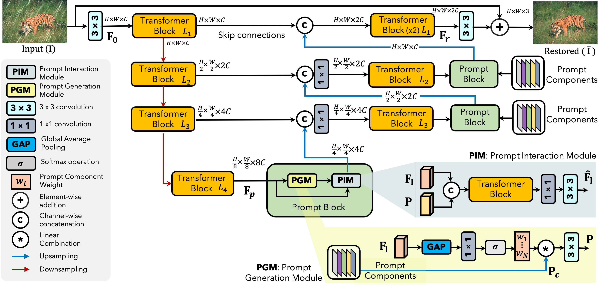
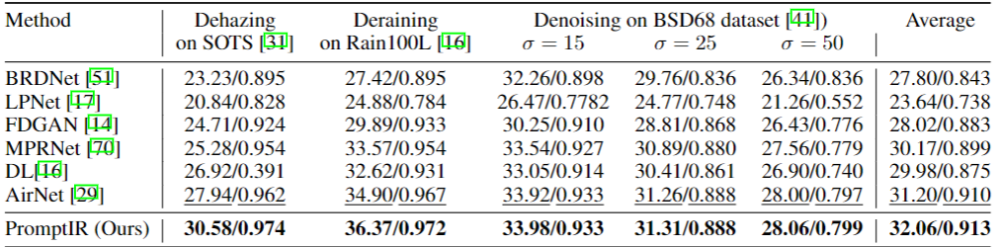

# PromptIR: Prompting for All-in-One Blind Image Restoration (NeurIPS'23)

[Vaishnav Potlapalli](https://www.vaishnavrao.com/), [Syed Waqas Zamir](https://scholar.google.es/citations?user=WNGPkVQAAAAJ&hl=en), [Salman Khan](https://salman-h-khan.github.io/) and [Fahad Shahbaz Khan](https://scholar.google.es/citations?user=zvaeYnUAAAAJ&hl=en)

[](https://arxiv.org/abs/2306.13090)


<hr />

> **Abstract:** *Image restoration involves recovering a high-quality clean image from its degraded
version. Deep learning-based methods have significantly improved image restora-
tion performance, however, they have limited generalization ability to different
degradation types and levels. This restricts their real-world application since it
requires training individual models for each specific degradation and knowing the
input degradation type to apply the relevant model. We present a prompt-based
learning approach, PromptIR, for All-In-One image restoration that can effectively
restore images from various types and levels of degradation. In particular, our
method uses prompts to encode degradation-specific information, which is then
used to dynamically guide the restoration network. This allows our method to
generalize to different degradation types and levels, while still achieving state-of-
the-art results on image denoising, deraining, and dehazing. Overall, PromptIR
offers a generic and efficient plugin module with few lightweight prompts that can
be used to restore images of various types and levels of degradation with no prior
information of corruptions.* 
<hr />

## Network Architecture

 

## Installation and Data Preparation

See [INSTALL.md](INSTALL.md) for the installation of dependencies and dataset preperation required to run this codebase.

## Training

After preparing the training data in ```data/``` directory, use 
```
python train.py
```
to start the training of the model. Use the ```de_type``` argument to choose the combination of degradation types to train on. By default it is set to all the 3 degradation types (noise, rain, and haze).

Example Usage: If we only want to train on deraining and dehazing:
```
python train.py --de_type derain dehaze
```

## Testing

After preparing the testing data in ```test/``` directory, place the mode checkpoint file in the ```ckpt``` directory. The pretrained model can be downloaded [here](https://drive.google.com/file/d/1j-b5Od70pGF7oaCqKAfUzmf-N-xEAjYl/view?usp=sharingg), alternatively, it is also available under the releases tab. To perform the evalaution use
```
python test.py --mode {n}
```
```n``` is a number that can be used to set the tasks to be evaluated on, 0 for denoising, 1 for deraining, 2 for dehaazing and 3 for all-in-one setting.

Example Usage: To test on all the degradation types at once, run:

```
python test.py --mode 3
```

## Demo
To obtain visual results from the model ```demo.py``` can be used. After placing the saved model file in ```ckpt``` directory, run:
```
python demo.py --test_path {path_to_degraded_images} --output_path {save_images_here}
```
Example usage to run inference on a directory of images:
```
python demo.py --test_path './test/demo/' --output_path './output/demo/'
```
Example usage to run inference on an image directly:
```
python demo.py --test_path './test/demo/image.png' --output_path './output/demo/'
```
To use tiling option while running ```demo.py``` set ```--tile``` option to ```True```. The Tile size and Tile overlap parameters can be adjusted using ```--tile_size``` and ```--tile_overlap``` options respectively.


## Results
Performance results of the PromptIR framework trained under the all-in-one setting

<summary><strong>Table</strong> </summary>

 

<summary><strong>Visual Results</strong></summary>

The visual results of the PromptIR model evaluated under the all-in-one setting can be downloaded [here](https://drive.google.com/drive/folders/1Sm-mCL-i4OKZN7lKuCUrlMP1msYx3F6t?usp=sharing)


## Citation
If you use our work, please consider citing:

    @inproceedings{potlapalli2023promptir,
      title={PromptIR: Prompting for All-in-One Image Restoration},
      author={Potlapalli, Vaishnav and Zamir, Syed Waqas and Khan, Salman and Khan, Fahad},
      booktitle={Thirty-seventh Conference on Neural Information Processing Systems},
      year={2023}
    }


## Contact
Should you have any questions, please contact vaishnav.potlapalli@mbzuai.ac.ae


**Acknowledgment:** This code is based on the [AirNet](https://github.com/XLearning-SCU/2022-CVPR-AirNet) and [Restormer](https://github.com/swz30/Restormer) repositories. 

